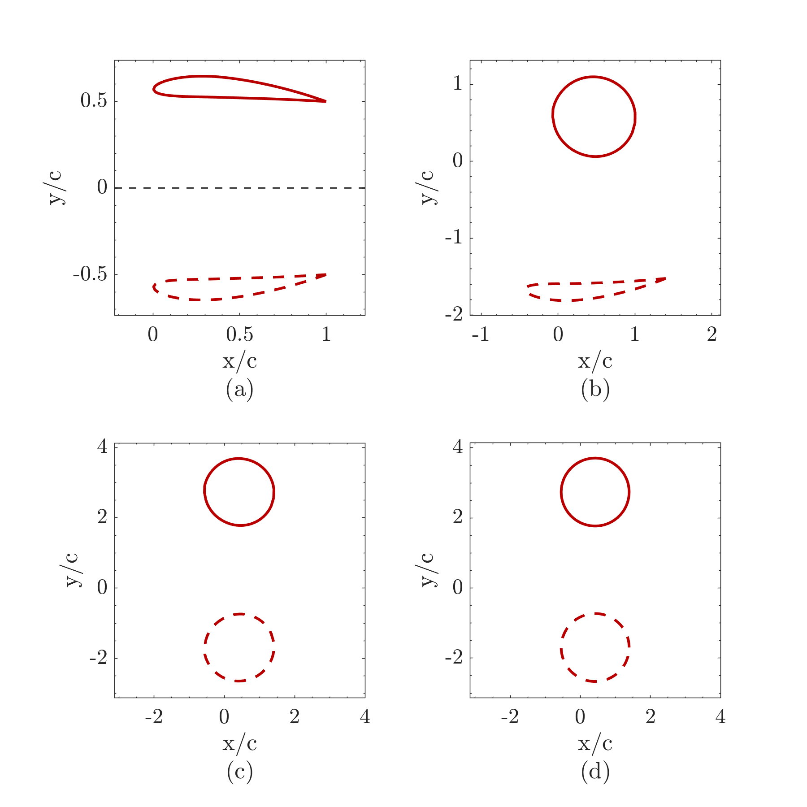
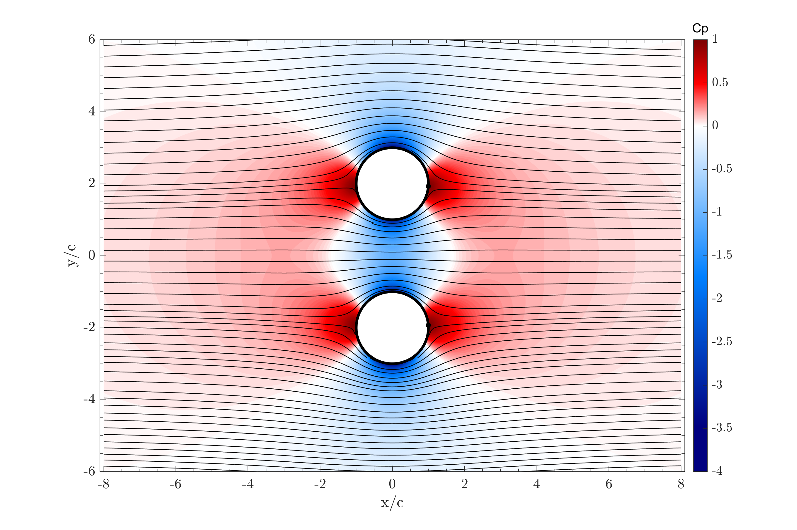
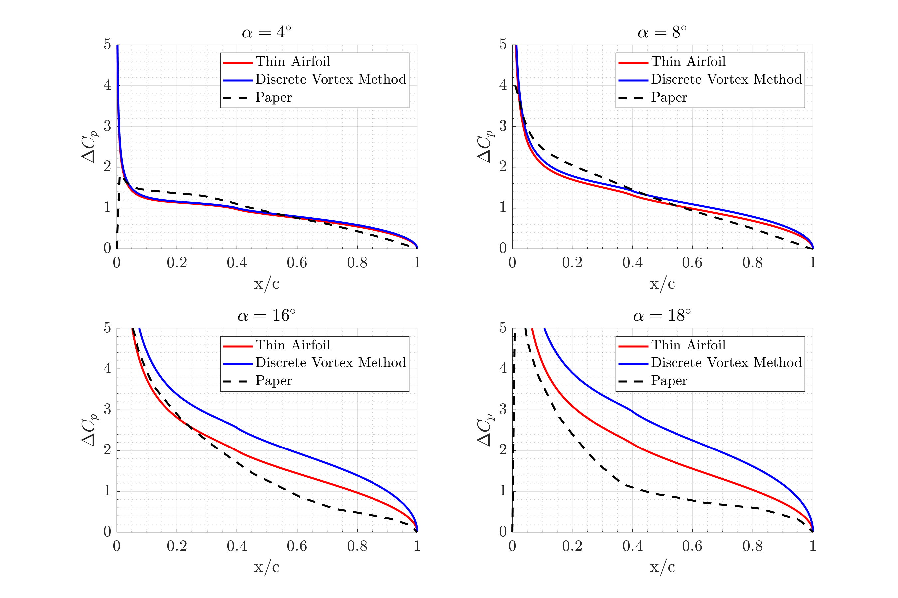
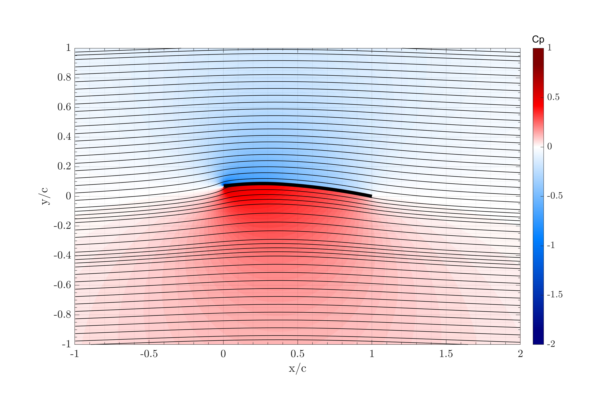

# aerodynamics
_Why does ground effect increase lift? Can classical aerodynamics predict it?_

## Overview
This project aims to reproduce results from the paper titled "Airfoil Aerodynamics in Ground Effect for Wide Range of Angles of Attack" by Qiulin Qu, Wei Wang, and Peiqing Liu, published in the AIAA Journal in 2014. The focus is on analyzing the aerodynamics of airfoils in ground effect using potential flow theory and thin airfoil theory, compared against viscous Computational Fluid Dynamics (CFD) results.

### Potential Flow Theory
1. **Conformal Mapping**: The project utilizes a conformal mapping technique to transform the geometry of the airfoils with ground effect into two circles. This method allows for easier analytical solutions for potential flow over the airfoils. The process takes three steps: The airfoil and its mirror image to simulate the ground are mapped to quasi-circular domains by removing the sharp trailing edge, and then mapped to two perfect cylinders with a Fornberg-like conformal method.
2. **Flow over Cylinders**: Once the airfoil shapes are mapped to circles, the flow properties over two cylinders are calculated by repeated application of the Milne-Thomson circle theorem. This provides the necessary aerodynamic properties to analyze the effects of ground proximity.
   

      
      
   

### Thin Airfoil Theory (No Ground Effect)
- **Classical Thin Airfoil Theory**: This section employs classical thin airfoil theory to derive expressions for lift and drag coefficients without considering the ground effect. The theory uses trigonometric expansions to model the flow around the airfoil.

- **Discrete Vortex Method**: The Discrete Vortex Method (DVM) is implemented to visualize the flow field around the airfoil and compute aerodynamic properties. The DVM discretizes the circulation around the airfoil to obtain lift and drag characteristics effectively.

   
   

## Conclusion
The inviscid ideal theories show good agreements for low angles of attack, and far from the ground. In other cases viscosity plays an important role in lift and pressure distribution calculation. For details, we encourage you to look at the report.pdf!
